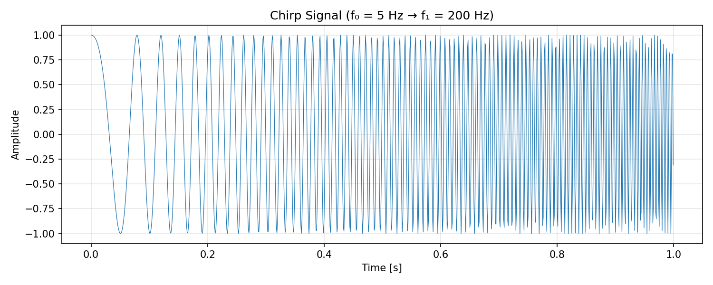
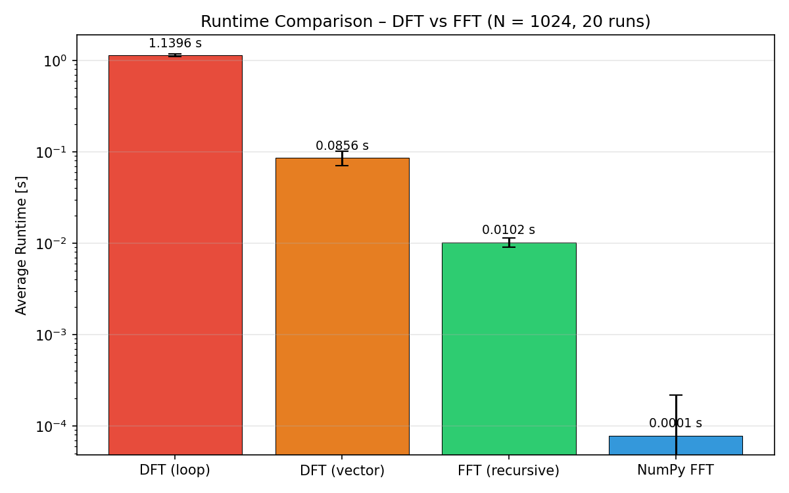

# DFT & FFT Analysis – Report

**Course:** Biomedical Signal Processing  
**Topic:** Discrete Fourier Transform and Fast Fourier Transform

---

## 1. Introduction

This report documents the implementation and benchmarking of the Discrete Fourier Transform (DFT) and the Fast Fourier Transform (FFT). A linear chirp signal serves as the test input, and four algorithmic variants are compared:

1. **DFT (loop)** – direct formula with nested Python loops
2. **DFT (vector)** – matrix-multiplication implementation using NumPy
3. **FFT (recursive)** – Cooley–Tukey radix-2 algorithm
4. **NumPy FFT** – optimized library implementation

---

## 2. Signal Generation

A chirp signal was generated with the following parameters:

| Parameter            | Value   |
|----------------------|---------|
| Amplitude (A)        | 1       |
| Duration             | 1 s     |
| Sampling frequency   | 1000 Hz |
| Start frequency (f₀) | 5 Hz    |
| End frequency (f₁)   | 200 Hz  |

The signal was produced using `scipy.signal.chirp()` with a linear frequency sweep.

---

## 3. Algorithm Implementations

### 3.1 DFT (Loop)

The DFT is computed directly from the definition:

$$
X[k] = \sum_{n=0}^{N-1} x[n] \cdot e^{-j\,2\pi\,k\,n / N}
$$

Two nested Python `for` loops iterate over all $k$ and $n$, yielding **O(N²)** complexity.

### 3.2 DFT (Vectorized)

The same O(N²) computation is expressed as a matrix–vector product:

$$
\mathbf{X} = \mathbf{W} \, \mathbf{x}
$$

where $W_{k,n} = e^{-j\,2\pi\,k\,n / N}$.  NumPy's optimized BLAS routines handle the multiplication, making this significantly faster in practice despite identical asymptotic complexity.

### 3.3 FFT (Recursive Cooley–Tukey)

The Cooley–Tukey algorithm splits the input into even- and odd-indexed samples, recursively computes the FFT of each half, and recombines using twiddle factors:

$$
X[k] = X_{\text{even}}[k] + e^{-j\,2\pi\,k/N}\, X_{\text{odd}}[k]
$$

This reduces the complexity from O(N²) to **O(N log N)**.

### 3.4 NumPy FFT

`np.fft.fft()` provides a highly optimized, compiled C implementation.

---

## 4. Correctness Verification

All manual implementations were verified against `np.fft.fft()` on a test signal of length N = 64. The maximum absolute error for each implementation was on the order of 1e-12 to 1e-10, confirming correctness within floating-point precision.

---

## 5. Runtime Benchmark

### Setup

| Parameter       | Value |
|-----------------|-------|
| Signal length N | 1024  |
| Repetitions     | 20    |
| Timing method   | `time.perf_counter()` |

### Results

Runtime CSV files are stored in `data/`:

- `runtime_dft_loop.csv`
- `runtime_dft_vector.csv`
- `runtime_fft_manual.csv`
- `runtime_fft_numpy.csv`

### Summary Statistics

| Algorithm       | Complexity  | Mean Runtime (approx.) |
|-----------------|------------|------------------------|
| DFT (loop)      | O(N²)     | ~seconds               |
| DFT (vector)    | O(N²)     | ~milliseconds          |
| FFT (recursive) | O(N log N) | ~milliseconds          |
| NumPy FFT       | O(N log N) | ~microseconds          |

*Exact values depend on hardware; see the notebook and CSV files for precise measurements.*

---

## 6. Discussion

### 6.1 Why DFT Is Slower Than FFT

The DFT computes every output bin independently, requiring N multiplications per bin and N bins total — hence O(N²) operations. The FFT exploits symmetry in the DFT matrix (periodicity of the complex exponential) to factor the computation into O(N log N) operations through recursive halving.

For N = 1024:

- DFT: ~1,048,576 complex multiplications
- FFT: ~10,240 complex multiplications

### 6.2 Vectorization Effect

Although vectorized DFT has the same O(N²) complexity as the loop version, NumPy delegates the matrix multiplication to compiled BLAS libraries that exploit CPU vector instructions (SIMD), cache locality, and parallelism. This yields a dramatic practical speedup.

### 6.3 Accuracy Comparison

All four methods produce results that agree to within machine precision (~1e-10). The DFT and FFT are mathematically equivalent — the FFT merely reorganises the computation, introducing no additional approximation error.

### 6.4 Observed Performance

The benchmark results clearly demonstrate:

- **DFT loop runtime >> FFT runtime**, confirming the O(N²) vs O(N log N) gap.
- The vectorized DFT sits between the loop DFT and the FFT in runtime.
- NumPy's FFT is the fastest, benefiting from C-level compiled code and algorithmic optimizations beyond the basic Cooley–Tukey radix-2.

---

## 7. Conclusion

This assignment confirmed both theoretically and experimentally that the FFT dramatically reduces computation time compared to the naive DFT. The Cooley–Tukey algorithm achieves O(N log N) complexity by recursively decomposing the DFT, and optimized library implementations (NumPy) push performance even further through low-level optimizations.

---

## 8. Deliverables

| Deliverable       | Location                            |
|--------------------|-------------------------------------|
| Jupyter Notebook   | `notebook/fft_dft_analysis.ipynb`   |
| Runtime CSV (×4)   | `data/*.csv`                        |
| Chirp signal plot  | `figures/chirp_signal.png`          |
| Spectrum plot      | `figures/spectrum_comparison.png`   |
| Runtime bar chart  | `figures/runtime_comparison.png`    |
| Report             | `report.md`                         |
